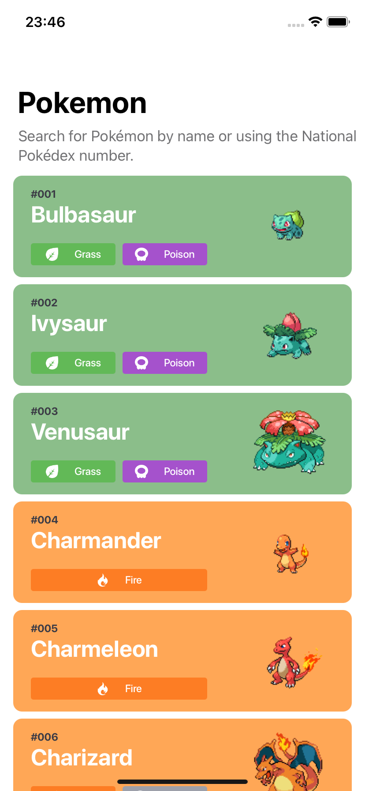

# Pokédex

## What is about?
This is a project that I developed for my portfolio.

The main goal is build a totally functional Pokédex. Currently, this version only fetches a bunch of data from [PokéAPI](https://pokeapi.co) and displays it in a list.

In the future, new features will be add.

## What are those future features?

- [ ] Search a pokémon by name or id.
- [ ] Scan a picture of a pokémon and recognize it.
- [ ] Make it more like to original design.
- [ ] Update images been used.

## What can be better (in code manner)?

This project also has it's vias of making me think about the code I made. So here goes some thoughts that later they will be turned into issues.

### Next issues

* I strongly believe that my Dependency Injection needs work. Because, my View layer is strongly attached to my ViewModel layer, making it hard to test. The best was to connect them by protocols. This lead to some problems like testing. I did a lot of tests with my Service layer, but I didn't on my View.
* Create Mock classes to allow my HomeView render on canvas. Part of my project I programmed looking on my iPhone, because I couldn't see what I was doing.

## Design

The design was made by [Flavio Farias](https://www.behance.net/flaviofpsj) and you can find [here](https://www.behance.net/gallery/95727849/Pokdex-App?tracking_source=search_projects_recommended%7Cpokedex) the project.
